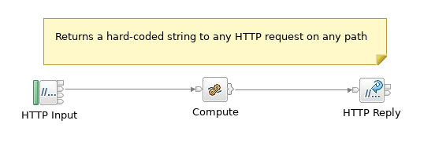
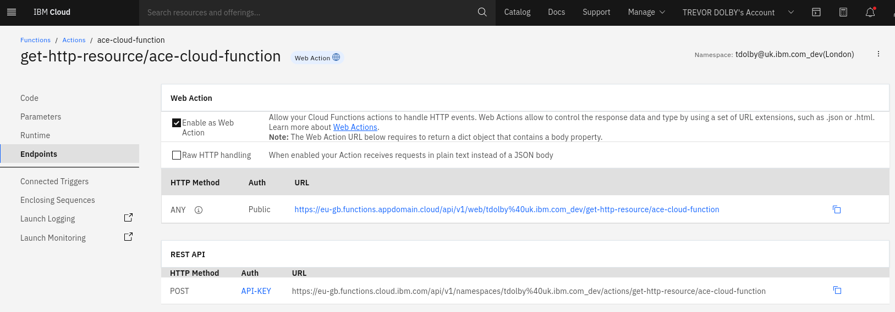
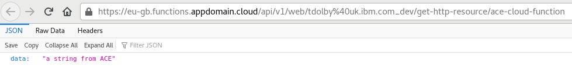

# ace-cloud-function
IBM Cloud Functions with ACE flows

ACE integration servers can act as function-as-a-service providers when running with 
certain applications and flows; the files in this repo provide a demonstration of a 
basic application running in IBM Cloud Functions.

## Overview

The application is extremely simple, returning a constant JSON string regardless of 
HTTP method or URL:


and the main focus is very much on how to get ACE flows to run in Cloud Functions.

The Docker image used to run this flow is built on ace-minimal in order to keep the
image size down; see https://github.com/tdolby-at-uk-ibm-com/ace-docker/tree/master/experimental/ace-minimal
for the underlying docker files.

Familiarity with IBM Cloud Functions is assumed, as is an IBM Cloud ID. It appears
difficult to persuade Cloud Functions to pull images from a registry that requires
authentication, so this demo has used DockerHub itself; IDs can be obtained for free
and can then be used to serve the images for the ACE function.

## Running the code

To use the ACE function, with appropriate substitutions of usernames for IBM Cloud and 
DockerHub registry, run the following after cloning this repo:
```
docker build -t tdolby/experimental:ace-cloud-function -f Dockerfile .
docker push tdolby/experimental:ace-cloud-function
ibmcloud target -o tdolby@uk.ibm.com -s dev
ibmcloud fn action create --web yes get-http-resource/ace-cloud-function --docker tdolby/experimental:ace-cloud-function
```

After this, it should be possible to run the function from the Cloud Functions web
console as shown here:



and by clicking on the "Web Action" URL, the function should be invoked. Due to the 
size of the image, it may time out at first, but normally it would succeed on the
second attempt, and would then show



which demonstrates the string provided by the Compute node in the ACE flow.
